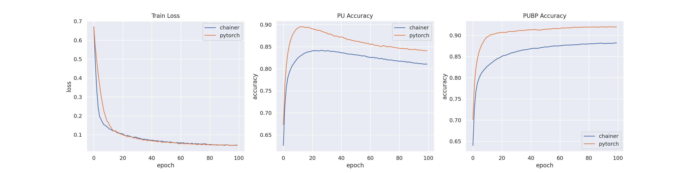

# BiasedPUlearnig: Positive and Unlabeled Data with a Selection Bias (ICLR 2019)

* Paper link: https://openreview.net/pdf?id=rJzLciCqKm
* Author's code repo: https://github.com/MasaKat0/PUlearning. Note that it is implemented by Chainer.

I implemented the [nnPUSB: Model with neural Networks](https://github.com/MasaKat0/PUlearning/tree/master/BiasedPUlearning/nnPUSB) by PyTorch and got a better performance.

Comparison of average results obtained by running experiment on the mnist dataset 10 times.

You can refer to the code of [test_mnist.py](src/test_mnist.py) to train your own model.